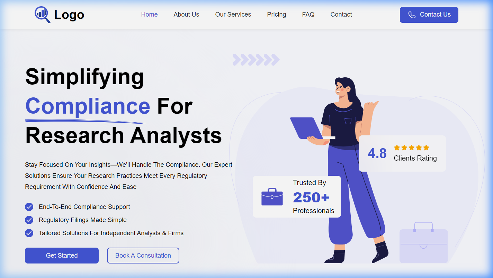

# Infotech Wizard - Full Stack Intern Assignment

This repository contains the implementation of a responsive landing page as part of the Full Stack Intern assignment for Infotech Wizard.

## 🚀 Live Demo
[Live URL on Vercel](https://infotech-project-theta.vercel.app/)

## 📸 UI Screenshots

### Desktop View (1440px)

### Tablet View (768px)

### Mobile View (375px)

---

## 📋 Internship Terms & Conditions
The following terms and conditions were acknowledged for this internship:

- **Position:** Full Stack Intern
- **Internship Duration:** 6 Months
- **Location:** Remote (Work From Home)
- **Working Hours:** 9:00 AM – 6:00 PM (6 days/week, Wednesday Off)
- **Stipend:** ₹2,500 per month
- **Monitoring:** Mandatory screen sharing via Google Meet during working hours.
- **Attendance:** Any leave treated as absence.
- **Certification:** Issued only upon successful 6-month completion.

## 🛠️ Task Requirements
- Convert Figma design into a static HTML/CSS (React/Tailwind) page.
- Ensure pixel-perfect implementation.
- Clean and properly structured code.

## 🛠️ Tech Stack
- **Frontend:** React 18, Vite
- **Styling:** Tailwind CSS, PostCSS
- **Components:** Radix UI, Emotion
- **Animations:** Framer Motion, Tailwind Animate

## 🚀 Running Locally
1. Clone the repository.
2. Run `npm install` to install dependencies.
3. Run `npm run dev` to start the development server.

## 🔗 Assignment Resources
- **Figma Design:** [View Design](https://drive.google.com/drive/folders/1WjZZEqOiQZY_ErMtikW8ACBNYatNczpF)
- **Tutorials:**
  - [Figma Design Inspection](https://youtu.be/hbN9RGcQFNU)
  - [Importing .fig files](https://youtu.be/64Baf8B6sYg)

---
**Submission Deadline:** 16 May, 2026